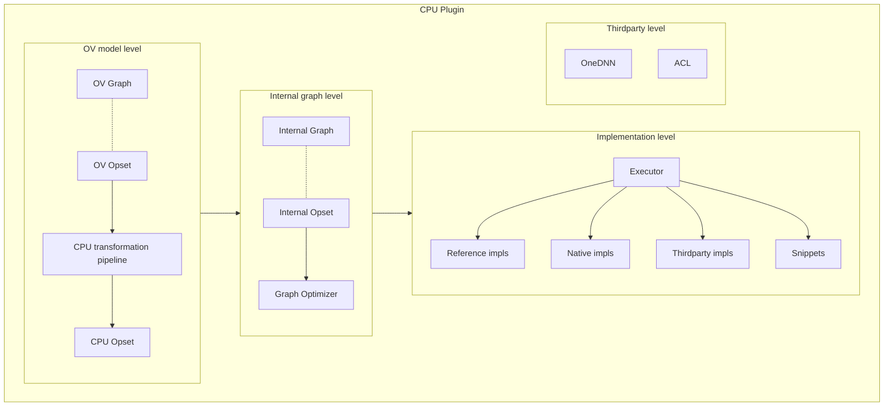
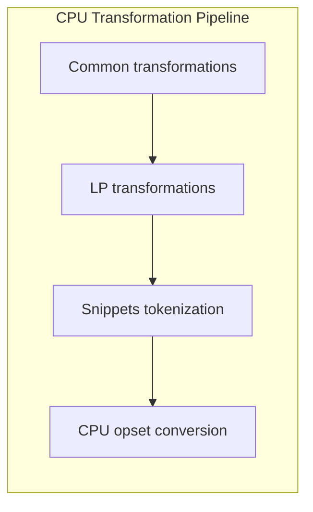
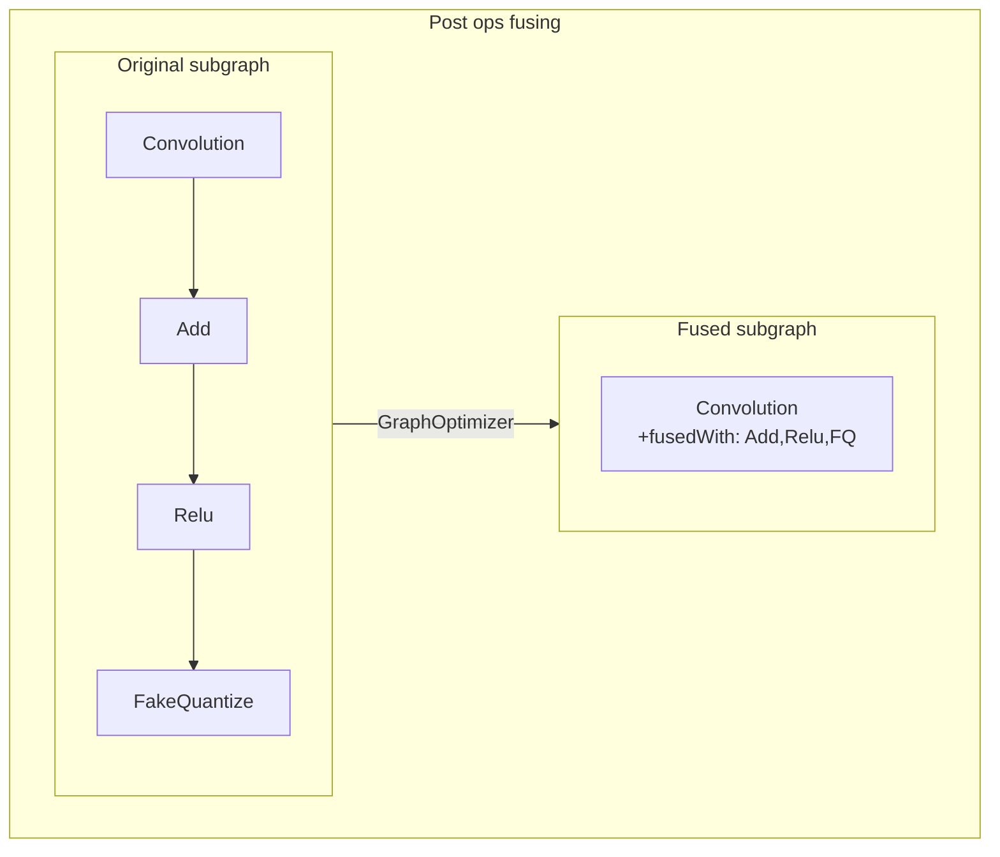
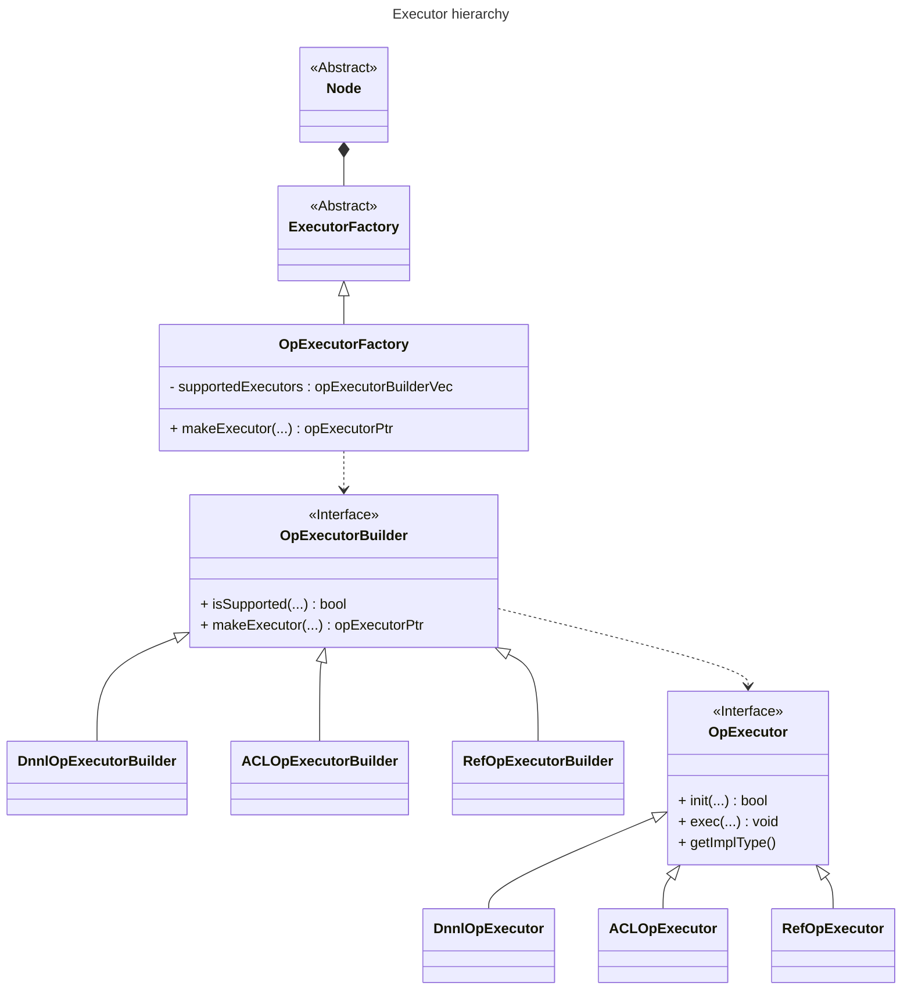

# OpenVINO™ CPU plugin

## Common flow




## CPU Transformation Pipeline




```
transformations
├── transformation_pipeline.cpp
├── cpu_opset
│   ├── common
│   │   ├── op
│   │   ├── pass
│   ├── x64
│   │   ├── ...
│   ├── arm
│   │   ├── ...
├── snippets
│   ├── x64
│   │   ├── ...
```

## Internal graph: post ops fusing



```
transformations
├── graph.cpp
├── cpu_opset
│   ├── common
│   │   ├── op
│   │   ├── pass
│   ├── x64
│   │   ├── ...
│   ├── arm
│   │   ├── ...
├── snippets
│   ├── x64
│   │   ├── ...
```

## Implementation level: Executor hierarchy

